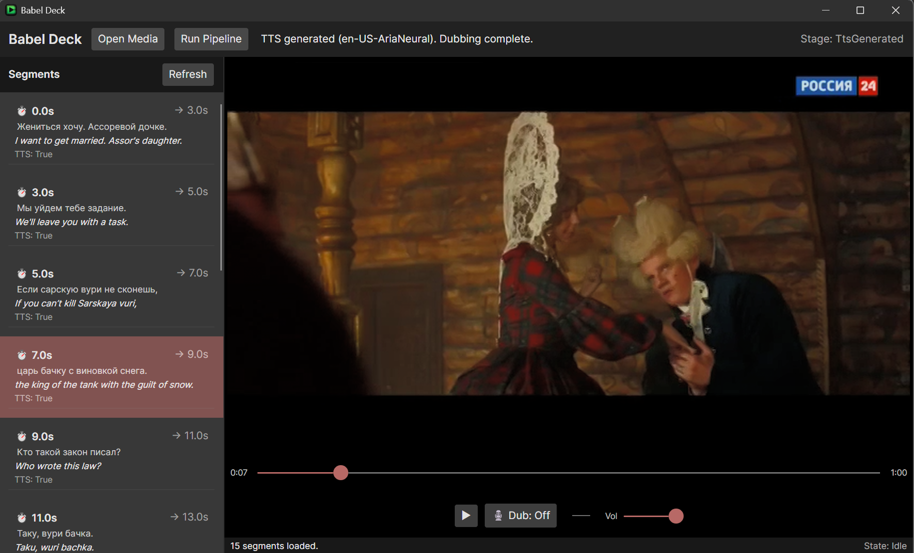

# Babel Player

[](https://github.com/sponsors/mta1124-1629472)
[](https://github.com/mta1124-1629472/Babel-Player/actions/workflows/ci.yml)
[](https://github.com/mta1124-1629472/Babel-Player/releases/latest)
[](#requirements)
[](https://dotnet.microsoft.com/)
[](#status)

> **Early alpha.** Core workflow is functional end-to-end, but the app is under active development. Expect rough edges, missing polish, and breaking changes between builds.

Babel Player is a Windows desktop dubbing workstation. Load a local video, generate a timed transcript via Whisper, translate the dialogue, synthesize dubbed speech via TTS, and preview the result in-context — all from a single session.

Babel Deck is built and maintained by a solo developer. If you’d like to support its continued development:
[](https://ko-fi.com/R5R01WOOYW)



---

## What it does today

The end-to-end workflow runs from source media through to playable dubbed audio:

1. **Load media** — open any local video file (MP4, MKV, AVI, WebM, MOV)
2. **Transcribe** — generate a timed source-language transcript using Whisper (via Python)
3. **Translate** — produce target-language dialogue adapted for spoken delivery
4. **Generate dubbed audio** — synthesize TTS audio per segment
5. **Preview** — scrub the source video, toggle dub mode to hear TTS follow the video in real time, and click any segment in the sidebar to jump directly to that timestamp
6. **Persist sessions** — work is saved between launches; artifacts are restored without re-running the pipeline

Segment selection in the sidebar is live: the active segment highlights as the video plays and the list scrolls to track it automatically.

---

## What it does not do yet

To be direct about current limits:

- **No audio mixing** — dubbed TTS and source audio are not mixed; they play independently
- **No sync guarantee** — TTS follows the video segment-by-segment, not frame-accurate lip sync
- **No export** — there is no way to export a dubbed video file yet
- **No setup wizard** — a settings UI exists, but Python, FFmpeg, and any external/local inference service still need to be installed and reachable
- **Windows only** — libmpv is loaded via P/Invoke from a bundled DLL; macOS and Linux are not supported
- **No multi-language UI** — the interface is English only

---

## Requirements

| Dependency | Notes |
|-----------|-------|
| Windows 10/11 x64 | Only tested platform |
| [.NET 10 SDK or Runtime](https://dotnet.microsoft.com/download/dotnet/10.0) | Needed for source builds; GitHub release bundles are self-contained |
| Python 3.10+ | Required for transcription, translation, and TTS |
| Whisper-compatible Python environment | Transcription backend |
| FFmpeg | Audio extraction; placed in `tools/win-x64/ffmpeg.exe` or on `PATH` |
| libmpv-2.dll | Bundled in `native/win-x64/` — GPU video output via `vo=gpu` |

---

## Install from GitHub Releases

For normal users, prefer the latest GitHub release over building from source:

1. Download `Babel-Player-<version>-win-x64-portable.zip`
2. Download the matching `.sha256` file
3. Extract the zip to a folder such as `C:\Apps\BabelPlayer`
4. Run `BabelPlayer.exe`

Release bundles already include:

- the .NET runtime needed to run the app
- `ffmpeg.exe`
- `libmpv-2.dll`
- the app executable and managed dependencies

Release bundles do **not** include Python or model/provider runtimes. See [`docs/install-windows-release.md`](docs/install-windows-release.md) for the user-facing install notes that ship with the release.

---

## Run from source

```bash
git clone https://github.com/mta1124-1629472/Babel-Player.git
cd Babel-Player
dotnet build
dotnet run --project BabelPlayer.csproj
```

Tests:

```bash
dotnet test
```

---

## How the pipeline works

```
source video
    └─ ingest (copy to session artifact dir)
        └─ transcribe (Whisper via Python subprocess)
            └─ translate (Python inference)
                └─ TTS generation (per segment, Python or external/local inference service)
                    └─ preview (libmpv + Avalonia UI)
```

All artifacts are stored in a session directory under `%LOCALAPPDATA%\BabelPlayer\sessions\`. The session survives restarts; switching between multiple source files within a run caches prior work in memory and restores it without re-running the pipeline.

Container note:
- the supported container posture today is an external/local inference service consumed over HTTP
- the desktop app does not package or launch itself in Docker
- `INFERENCE_SERVICE_URL` overrides the saved container service URL at startup when set

---

## Contributing

Read these before touching anything:

- [`AGENTS.md`](AGENTS.md) — operating rules and scope discipline
- [`PLAN.md`](PLAN.md) — milestone order and gates
- [`docs/architecture.md`](docs/architecture.md) — structural boundaries and state ownership
- [`CONTRIBUTING.md`](CONTRIBUTING.md) — contributor workflow and verification expectations

The short version: a feature is not done because it compiles. It is done when it has build, tests, and a written smoke result.
